# 🎉 CI/CD Setup Complete!

Your GitHub Actions CI/CD pipeline has been configured! Here's what I've created for you.

## 📁 Files Created

### GitHub Actions Workflows
1. **`.github/workflows/deploy.yml`**
   - Runs tests before deployment
   - Builds frontend assets
   - Deploys to VPS via SSH
   - Triggered on push to `main` branch

2. **`.github/workflows/test.yml`**
   - Runs on pull requests and non-main branches
   - Tests against PHP 8.2, 8.3, and 8.4
   - Runs code quality checks (Pint, ESLint, TypeScript, Prettier)

### Deployment Script
3. **`deploy.sh`**
   - Zero-downtime deployment script
   - Automatic rollback on failure
   - Manages multiple releases (keeps last 5)
   - Optimizes Laravel application
   - Runs migrations automatically

### Documentation
4. **`DEPLOYMENT.md`** - Complete deployment guide with:
   - VPS setup instructions
   - GitHub Secrets configuration
   - Web server configuration (Nginx/Apache)
   - Troubleshooting guide
   - Security best practices

5. **`DEPLOYMENT_CHECKLIST.md`** - Step-by-step checklist to track your progress:
   - VPS setup tasks
   - SSH configuration
   - GitHub Secrets
   - Testing procedures
   - Post-deployment verification

6. **`DEPLOYMENT_COMMANDS.md`** - Quick reference for:
   - Common deployment commands
   - Rollback procedures
   - Maintenance tasks
   - Emergency commands
   - Troubleshooting helpers

### Templates
7. **`.github/PULL_REQUEST_TEMPLATE.md`** - PR template for better code reviews

8. **Updated `README.md`** - Added deployment section

## 🚀 What Happens When You Push to Main

```mermaid
graph LR
    A[Push to main] --> B[Run Tests]
    B --> C{Tests Pass?}
    C -->|No| D[Fail - No Deploy]
    C -->|Yes| E[Build Frontend]
    E --> F[Create Package]
    F --> G[Upload to VPS]
    G --> H[Run deploy.sh]
    H --> I[New Release]
    I --> J[Run Migrations]
    J --> K[Optimize Laravel]
    K --> L[Switch to New]
    L --> M{Health Check}
    M -->|Pass| N[Success! 🎉]
    M -->|Fail| O[Rollback]
```



## ⚡ Quick Start (Next Steps)

### 1️⃣ Setup Your VPS (15 minutes)
```bash
# SSH into your VPS
ssh user@your-vps-ip

# Create directory structure
mkdir -p ~/labortrack/{releases,shared/storage}

# Create PostgreSQL database
sudo -u postgres psql
CREATE DATABASE labortrack;
CREATE USER labortrack_user WITH PASSWORD 'your_secure_password';
GRANT ALL PRIVILEGES ON DATABASE labortrack TO labortrack_user;
\q

# Create .env file
nano ~/labortrack/shared/.env
# Copy production environment variables here
# Don't forget to set PostgreSQL credentials!

# Upload deploy.sh (or it will come with first deployment)
```

### 2️⃣ Configure GitHub Secrets (5 minutes)
Go to: **GitHub Repository** → **Settings** → **Secrets and variables** → **Actions**

Add these 5 secrets:
- `VPS_HOST` - Your VPS IP address
- `VPS_USERNAME` - SSH username
- `VPS_SSH_KEY` - Full private SSH key
- `VPS_PORT` - SSH port (usually 22)
- `VPS_DEPLOY_PATH` - Path to deployment directory

### 3️⃣ Configure Web Server (10 minutes)
Point your Nginx/Apache to: `~/labortrack/current/public`

See **DEPLOYMENT.md** for configuration examples.

### 4️⃣ Test Deployment (2 minutes)
```bash
# Make a small change and push
git add .
git commit -m "test: trigger deployment"
git push origin main

# Watch the deployment
# Go to: https://github.com/your-username/your-repo/actions
```

## 📊 Features

### ✅ Automated Testing
- Runs tests on every push
- Multiple PHP versions tested (8.2, 8.3, 8.4)
- Code quality checks (linting, formatting)
- Prevents broken code from being deployed

### ✅ Zero-Downtime Deployment
- New releases deployed to separate directory
- Atomic symlink switch
- Old release remains available for quick rollback
- No downtime during deployment

### ✅ Automatic Rollback
- If deployment fails, automatically reverts to previous release
- Health checks ensure site is working
- Safe to deploy with confidence

### ✅ Multiple Releases Management
- Keeps last 5 releases
- Quick rollback to any previous version
- Automatic cleanup of old releases

### ✅ Production Optimizations
- Composer dependencies optimized
- Laravel configs cached
- Routes cached
- Views cached
- Autoloader optimized

## 🏗️ Directory Structure on VPS

After first deployment:
```
~/labortrack/
├── current -> releases/20250107120000    # Active version (symlink)
├── deploy.sh                             # Deployment script
├── backups/                              # Database backups
├── releases/
│   ├── 20250107100000/                   # Release 1
│   ├── 20250107110000/                   # Release 2
│   └── 20250107120000/                   # Release 3 (current)
└── shared/
    ├── .env                              # Production config (with PostgreSQL credentials)
    └── storage/                          # Uploads & logs
```

## 🔐 Security Considerations

### ✅ SSH Key Security
- Use dedicated SSH key for GitHub Actions
- Don't reuse personal keys
- Restrict key to GitHub IPs only (optional)

### ✅ Environment Variables
- Never commit `.env` files
- Store secrets in GitHub Secrets
- Use strong APP_KEY

### ✅ Server Hardening
- Enable firewall (UFW)
- Use SSH key authentication only
- Keep packages updated
- Configure fail2ban (optional)

## 📖 Documentation Overview

| File | Purpose | When to Use |
|------|---------|-------------|
| **DEPLOYMENT.md** | Complete guide | Setting up for first time |
| **DEPLOYMENT_CHECKLIST.md** | Task checklist | During initial setup |
| **DEPLOYMENT_COMMANDS.md** | Command reference | Day-to-day operations |
| **POSTGRESQL_SETUP.md** | Database guide | PostgreSQL setup & management |
| **README.md** | Project overview | General information |

## 🎯 Recommended Next Steps

1. **Read** `DEPLOYMENT.md` thoroughly
2. **Follow** `DEPLOYMENT_CHECKLIST.md` step by step
3. **Setup** your VPS and GitHub Secrets
4. **Test** with a small deployment
5. **Bookmark** `DEPLOYMENT_COMMANDS.md` for reference
6. **Monitor** first few deployments closely

## 💡 Pro Tips

### For Development
- Create feature branches for new work
- Open PRs to trigger tests automatically
- Review test results before merging
- Merge to `main` only when ready to deploy

### For Production
- Monitor logs after each deployment
- Keep database backups
- Test rollback procedure once
- Document any manual changes
- Set up uptime monitoring

### For Team
- Share VPS access securely
- Document deployment procedures
- Create runbook for emergencies
- Establish deployment schedule (if needed)

## 🆘 If Something Goes Wrong

### Deployment Failed?
1. Check GitHub Actions logs
2. SSH into VPS and check logs:
   ```bash
   tail -f ~/labortrack/shared/storage/logs/laravel.log
   ```
3. Run deployment manually:
   ```bash
   cd ~/labortrack && bash -x deploy.sh
   ```
4. See `DEPLOYMENT.md` troubleshooting section

### Need to Rollback?
```bash
cd ~/labortrack
ls -lt releases/  # Find previous release
ln -sfn releases/PREVIOUS_DATE current
sudo systemctl reload php8.4-fpm
```

### Site is Down?
```bash
# Check services
sudo systemctl status php8.4-fpm
sudo systemctl status nginx

# Check logs
tail -f ~/labortrack/shared/storage/logs/laravel.log
sudo tail -f /var/log/nginx/error.log
```

## 📚 Additional Resources

- [GitHub Actions Documentation](https://docs.github.com/en/actions)
- [Laravel Deployment Best Practices](https://laravel.com/docs/deployment)
- [Digital Ocean Deployment Guide](https://www.digitalocean.com/community/tutorials)

## ✨ What's Next?

Your CI/CD pipeline is ready! Here's what you get:

✅ **Automatic deployments** on every push to main  
✅ **Automated testing** on every pull request  
✅ **Zero-downtime** deployments  
✅ **Automatic rollback** on failure  
✅ **Multiple releases** with easy rollback  
✅ **Production optimization** built-in  

Just follow the setup steps in `DEPLOYMENT_CHECKLIST.md` and you'll be deploying automatically in no time!

---

**Happy Deploying! 🚀**

*If you have questions or run into issues, refer to the troubleshooting sections in the documentation files.*

